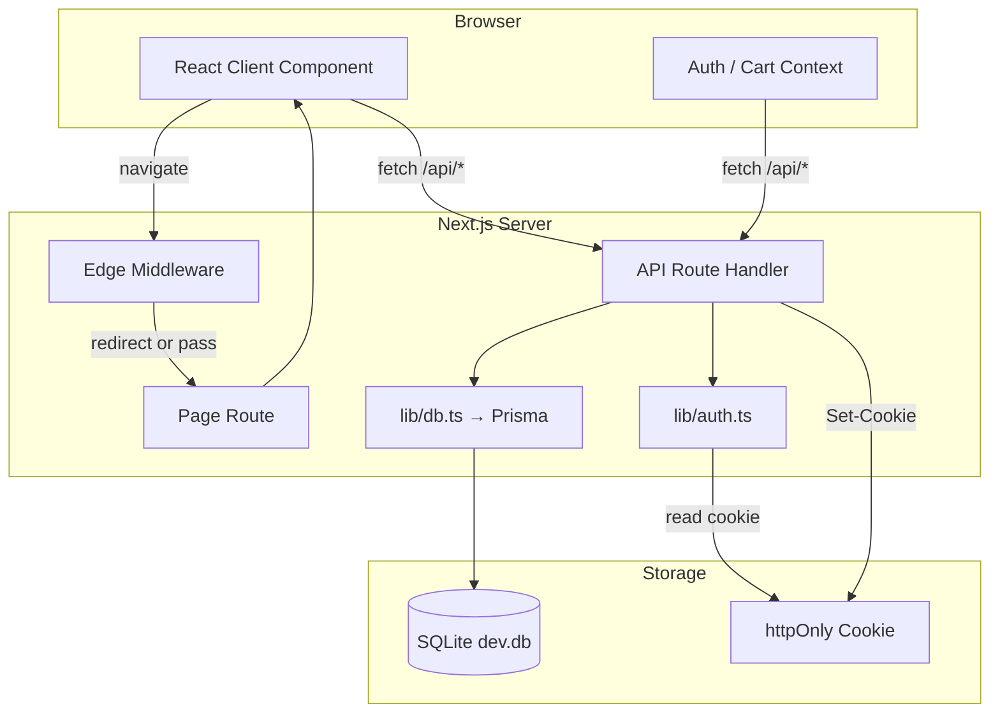
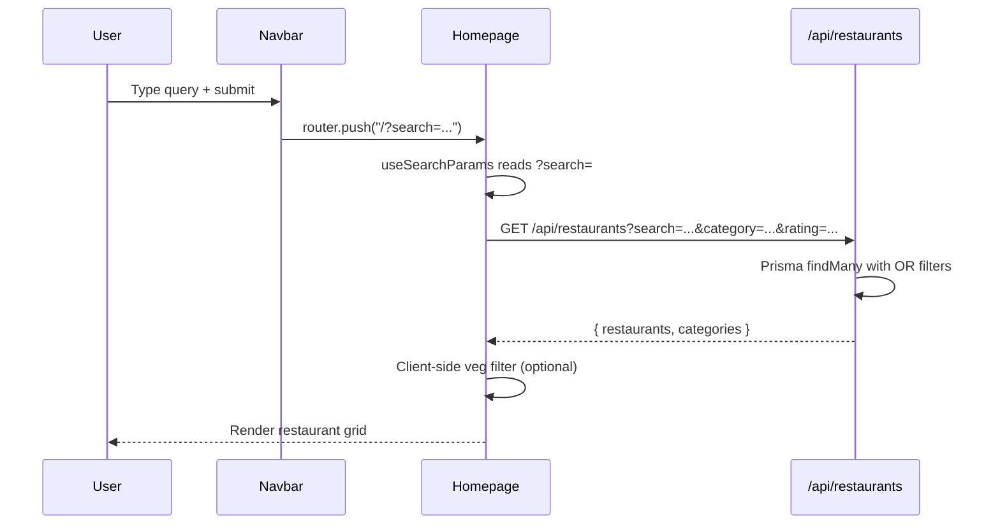
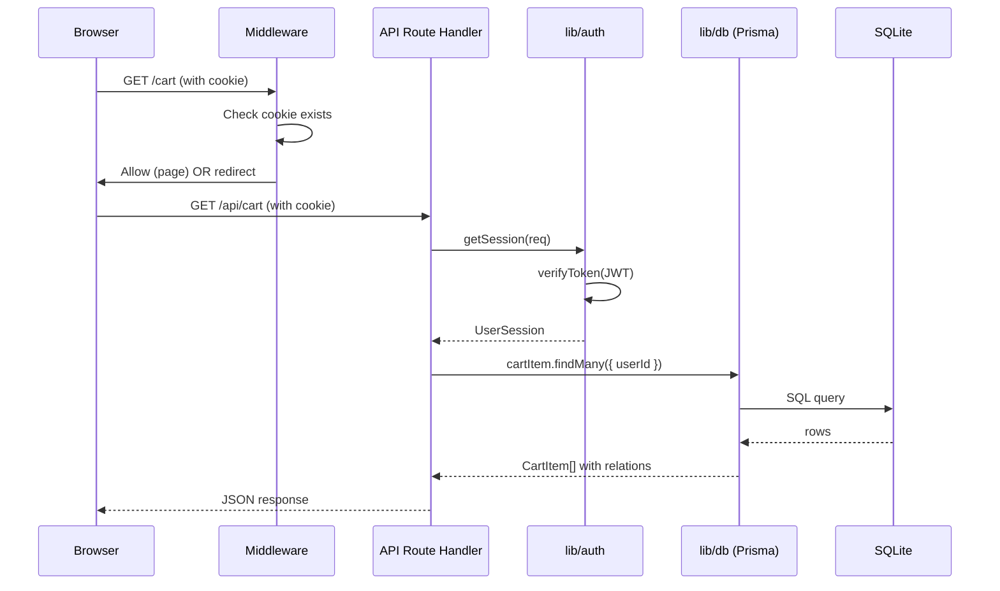
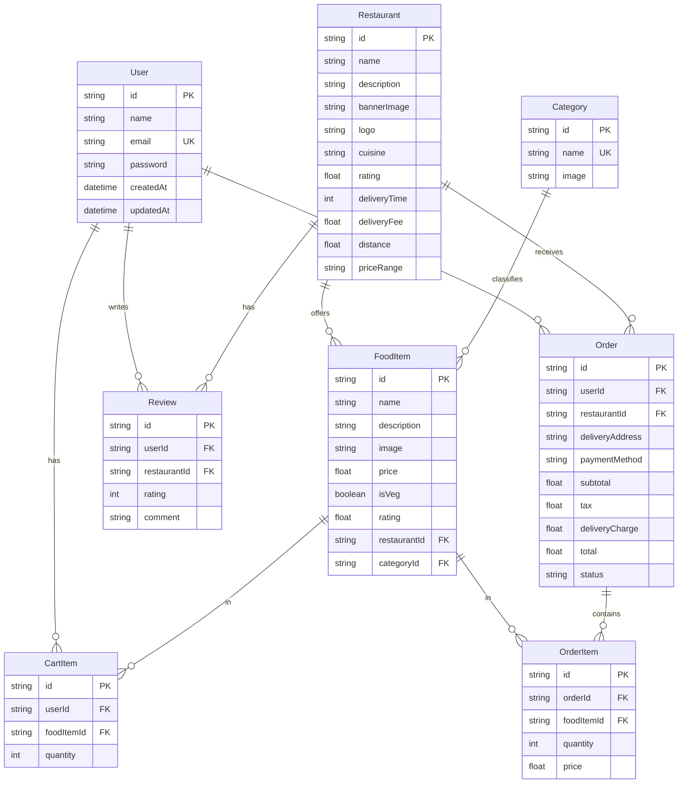
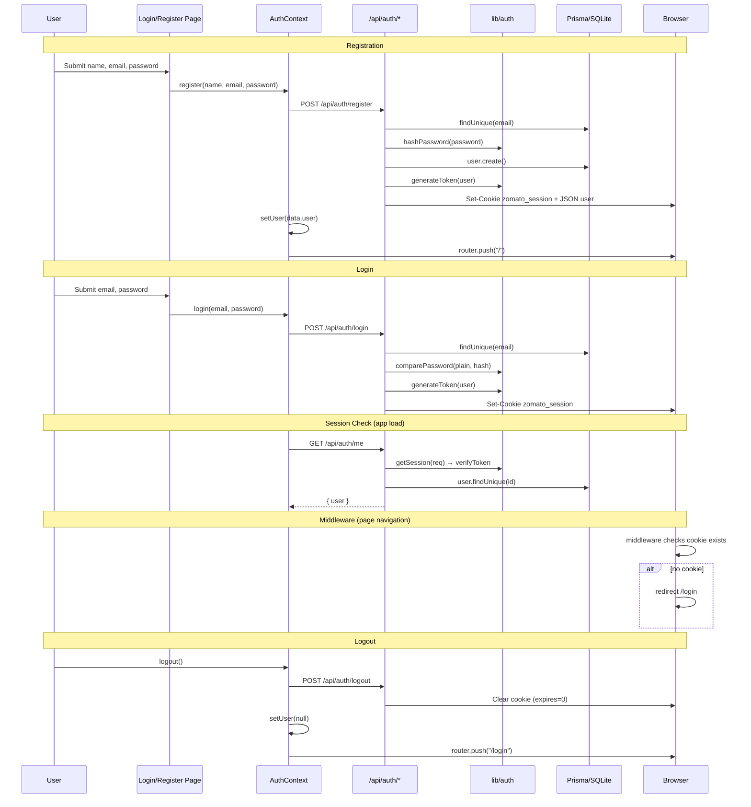
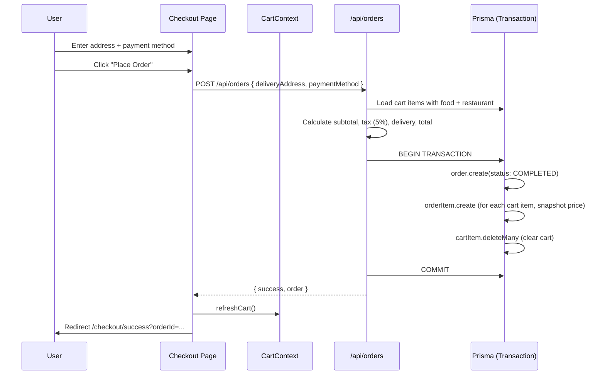

# Architecture Documentation — Zomato Food Ordering App

This document describes the complete technical architecture of the Zomato-inspired food ordering application. It is intended for developers who are new to the repository and need to understand how the system is structured, how data flows, and how each layer interacts.

---

## Table of Contents

1. [High-Level Architecture](#1-high-level-architecture)
2. [Folder Structure](#2-folder-structure)
3. [Frontend Architecture](#3-frontend-architecture)
4. [Backend Architecture](#4-backend-architecture)
5. [Database Architecture](#5-database-architecture)
6. [Authentication Flow](#6-authentication-flow)
7. [Cart System](#7-cart-system)
8. [API Documentation](#8-api-documentation)
9. [Database Models](#9-database-models)
10. [Data Flow](#10-data-flow)
11. [Dependencies](#11-dependencies)
12. [Design Decisions](#12-design-decisions)
13. [Scalability](#13-scalability)

---

## 1. High-Level Architecture

### Overall Architecture Style

The application follows a **monolithic full-stack architecture** built on **Next.js 15** using the **App Router**. A single codebase serves both the React frontend and the backend API. There is no separate API server — route handlers in `app/api/` act as the backend layer.

The pattern can be described as:

- **Presentation layer** — React Client Components with Tailwind CSS
- **Application layer** — Next.js Route Handlers + React Context for client state
- **Data access layer** — Prisma ORM over SQLite
- **Cross-cutting concerns** — Edge Middleware (route gating), JWT auth utilities

### Client-Server Interaction

The browser communicates with the server exclusively through:

1. **Page requests** — Next.js renders React pages (mostly client-rendered)
2. **API requests** — `fetch()` calls from the browser to `/api/*` endpoints
3. **Cookies** — The `zomato_session` httpOnly cookie carries the JWT on every request

There is no WebSocket, GraphQL, or third-party BaaS. All business logic runs in Next.js route handlers.

### Rendering Strategy

| Type | Where Used | Role |
|------|------------|------|
| **Server Components** | `app/layout.tsx`, `app/loading.tsx` | Root layout shell, global loading UI |
| **Client Components** | All `page.tsx` files, all `components/`, all `context/` | Interactive UI, data fetching, state |

**Important:** Nearly all pages are Client Components (`'use client'`). Data is fetched client-side via `fetch()` to internal API routes after the page mounts. There is no server-side data fetching in page components (no `async` page functions or Server Component data loaders).

### Request Lifecycle



### Data Flow (Summary)

1. User loads a page → Middleware checks for session cookie → Page renders
2. Client Components mount → Context providers fetch user/cart from APIs
3. User actions (search, add to cart, checkout) → `fetch()` to API routes
4. API routes validate JWT → Execute Prisma queries → Return JSON
5. Client updates React state → UI re-renders

---

## 2. Folder Structure

```
zomato/
├── app/                    # Next.js App Router — pages, layouts, API routes
│   ├── api/                # Backend REST endpoints (Route Handlers)
│   ├── cart/               # Cart page
│   ├── checkout/           # Checkout + success pages
│   ├── login/              # Login page
│   ├── register/           # Registration page
│   ├── profile/            # User profile + order history
│   ├── restaurants/[id]/   # Restaurant detail page
│   ├── globals.css         # Global styles (Tailwind import)
│   ├── layout.tsx          # Root layout (Server Component)
│   ├── loading.tsx         # Global loading fallback
│   └── page.tsx            # Homepage
├── components/             # Reusable UI components
├── context/                # React Context providers (global client state)
├── lib/                    # Server-side utilities (auth, database)
├── prisma/                 # Database schema, migrations, seed
├── public/                 # Static assets served at /
├── types/                  # Shared TypeScript interfaces
├── middleware.ts           # Edge middleware (route protection)
├── prisma.config.ts        # Prisma CLI configuration
├── next.config.ts          # Next.js configuration
└── package.json            # Dependencies and scripts
```

### Responsibility Separation

| Folder / File | Responsibility |
|---------------|----------------|
| **`app/`** | Routing, page composition, API endpoints. Each folder maps to a URL segment. |
| **`app/api/`** | Stateless HTTP handlers. Authentication, validation, Prisma queries, JSON responses. |
| **`components/`** | Presentational and lightly interactive UI (Navbar, RestaurantCard, Skeleton). No direct DB access. |
| **`context/`** | Client-side global state (user session, cart, toasts). Bridges UI and API via `fetch()`. |
| **`lib/`** | Shared server utilities. `auth.ts` for JWT/bcrypt; `db.ts` for Prisma singleton. |
| **`prisma/`** | Database schema definition, migration history, seed script. Source of truth for data model. |
| **`types/`** | TypeScript interfaces mirroring API response shapes. Used by client components and contexts. |
| **`middleware.ts`** | Runs on Edge before page routes. Cookie presence check and redirects. Not in a `middleware/` folder — lives at project root per Next.js convention. |
| **`public/`** | Static files (default Next.js SVG icons). Application images are external Unsplash URLs. |

### Folders Not Present

The project does **not** include separate `styles/`, `utils/`, or `middleware/` directories:

- **Styles** live in `app/globals.css` and inline Tailwind classes
- **Utilities** live in `lib/`
- **Middleware** is a single root-level `middleware.ts` file

---

## 3. Frontend Architecture

### Routing

Next.js App Router uses **file-system-based routing**:

| URL | File | Description |
|-----|------|-------------|
| `/` | `app/page.tsx` | Homepage |
| `/login` | `app/login/page.tsx` | Login |
| `/register` | `app/register/page.tsx` | Register |
| `/restaurants/[id]` | `app/restaurants/[id]/page.tsx` | Restaurant detail |
| `/cart` | `app/cart/page.tsx` | Shopping cart |
| `/checkout` | `app/checkout/page.tsx` | Checkout |
| `/checkout/success` | `app/checkout/success/page.tsx` | Order confirmation |
| `/profile` | `app/profile/page.tsx` | Profile + orders |

Dynamic segments use `[id]` folders. API routes follow the same convention under `app/api/`.

### Layouts

There is a single **root layout** (`app/layout.tsx`) — a Server Component that wraps every page:

```
ToastProvider
  └── AuthProvider
        └── CartProvider
              └── {children}  ← page content
```

No nested layouts exist (no `app/cart/layout.tsx`, etc.). Each page includes `<Navbar />` manually where needed. Login and register pages omit the navbar.

### Client Components

All interactive pages declare `'use client'` at the top. They:

- Use React hooks (`useState`, `useEffect`)
- Call `fetch()` to load and mutate data
- Consume context via `useAuth()`, `useCart()`, `useToast()`
- Use Next.js navigation hooks (`useRouter`, `useSearchParams`, `usePathname`)

### Server Components

Only the root layout and `app/loading.tsx` are Server Components. They do not fetch data or hold interactive state.

### Shared UI Components

| Component | File | Purpose |
|-----------|------|---------|
| `Navbar` | `components/Navbar.tsx` | Sticky header: logo, search, cart badge, user menu. Wrapped in `<Suspense>` for `useSearchParams`. |
| `RestaurantCard` | `components/RestaurantCard.tsx` | Card linking to restaurant detail. Framer Motion hover animation. |
| `Skeleton` | `components/Skeleton.tsx` | Loading placeholders (`RestaurantCardSkeleton`, `FoodItemSkeleton`). |

Food item cards, order cards, and checkout forms are **inline in page files**, not extracted to shared components.

### State Management

State is managed through **React Context** — no Redux, Zustand, or React Query.

| Context | File | State | Persistence |
|---------|------|-------|-------------|
| `AuthContext` | `context/AuthContext.tsx` | `user`, `loading` | Session via httpOnly cookie; hydrated from `/api/auth/me` |
| `CartContext` | `context/CartContext.tsx` | `cartItems`, totals, `loading` | SQLite via `/api/cart`; refreshed when `user` changes |
| `ToastContext` | `context/ToastContext.tsx` | Toast queue | Ephemeral (in-memory, 3s auto-dismiss) |

**Provider order matters:** `CartProvider` depends on `useAuth()` from `AuthProvider`, so auth must wrap cart.

### Data Fetching

All data fetching is **client-side**:

```typescript
// Typical pattern in page components
useEffect(() => {
  async function fetchData() {
    const res = await fetch('/api/restaurants?search=...');
    const data = await res.json();
    setRestaurants(data.restaurants);
  }
  fetchData();
}, [dependencies]);
```

No Server Actions, no `getServerSideProps`, no React Server Component `async` pages.

### Search Flow



Search is URL-driven (`?search=`, `?category=`). Category chips and filter buttons update query params. The API searches restaurant name, cuisine, description, and nested food item names.

### Cart Flow

1. User clicks "Add to Cart" on restaurant page
2. `CartContext.addToCart(foodItemId)` → `POST /api/cart`
3. If cart has items from another restaurant → API returns `409 RESTAURANT_MISMATCH`
4. UI shows modal; user can confirm cart replacement (`forceClear: true`)
5. Cart refreshes via `GET /api/cart`
6. Navbar badge updates from `cartItems` in context

### Authentication Flow (Client Side)

1. On app load, `AuthProvider` calls `GET /api/auth/me`
2. If cookie is valid → `user` state is set
3. Login/register forms call context methods → `POST /api/auth/login` or `register`
4. API sets `zomato_session` cookie → context updates `user` → router navigates to `/`
5. Logout → `POST /api/auth/logout` → cookie cleared → redirect to `/login`

---

## 4. Backend Architecture

### Route Handlers

API routes are **Next.js Route Handlers** — files named `route.ts` that export HTTP method functions (`GET`, `POST`, `PUT`, `DELETE`).

```
app/api/auth/login/route.ts  →  POST /api/auth/login
app/api/cart/route.ts        →  GET, POST, PUT, DELETE /api/cart
```

Each handler follows this structure:

1. Parse request (JSON body or query params)
2. Authenticate (if required) via `getSession(req)`
3. Validate input (manual `if (!field)` checks)
4. Execute Prisma operations
5. Return `NextResponse.json(...)` with appropriate status code
6. Catch errors → log + return 500

### Authentication (Server)

| Function | File | Purpose |
|----------|------|---------|
| `hashPassword()` | `lib/auth.ts` | bcrypt hash (10 rounds) |
| `comparePassword()` | `lib/auth.ts` | bcrypt compare |
| `generateToken()` | `lib/auth.ts` | JWT sign (7-day expiry) |
| `verifyToken()` | `lib/auth.ts` | JWT verify |
| `getSession()` | `lib/auth.ts` | Extract + verify cookie from request |

JWT payload shape:

```typescript
interface UserSession {
  userId: string;
  email: string;
  name: string;
}
```

`JWT_SECRET` must be set in environment variables. The application throws if it is missing.

### Middleware

`middleware.ts` runs on the **Edge runtime** before page routes (not API routes).

| Condition | Action |
|-----------|--------|
| No cookie + not `/login` or `/register` | Redirect to `/login` |
| Cookie present + on `/login` or `/register` | Redirect to `/` |
| Otherwise | `NextResponse.next()` |

**Matcher:** All paths except `api`, `_next/static`, `_next/image`, `favicon.ico`, `images`.

**Limitation:** Middleware checks cookie **existence only**, not JWT validity. Expired or tampered tokens pass middleware but fail at the API layer.

### JWT Flow

```
Login/Register API
  → generateToken({ userId, email, name })
  → Set cookie: zomato_session=<JWT>
     (httpOnly, sameSite=lax, maxAge=7 days, secure in production)

Protected API
  → getSession(req)
  → Read zomato_session cookie
  → verifyToken(token)
  → Return UserSession or null → 401 if null
```

### Request Validation

Validation is **manual** — no Zod or similar schema library:

```typescript
if (!email || !password) {
  return NextResponse.json({ error: '...' }, { status: 400 });
}
```

### Business Logic Location

| Domain | Location |
|--------|----------|
| Auth | `app/api/auth/*` + `lib/auth.ts` |
| Restaurants | `app/api/restaurants/*` |
| Cart (incl. restaurant mismatch) | `app/api/cart/route.ts` |
| Orders (pricing, transaction) | `app/api/orders/route.ts` |
| Pricing totals (client display) | `context/CartContext.tsx` |

### Error Handling

- **400** — Missing or invalid input
- **401** — Missing or invalid session
- **404** — Resource not found (user, food item, restaurant)
- **409** — Restaurant mismatch when adding to cart
- **500** — Unhandled exceptions (logged to server console)

Errors return JSON: `{ error: string }` or `{ error, message }` for 409.

### Request Lifecycle: Browser → Database



---

## 5. Database Architecture

### Why SQLite?

SQLite was chosen for this project because:

- **Zero configuration** — single `dev.db` file, no separate database server
- **Fast local development** — ideal for demos, coursework, and submission
- **Prisma support** — first-class via `@prisma/adapter-better-sqlite3`
- **Portability** — database travels with the repository (after seeding)

Trade-off: SQLite is not suitable for high-concurrency production workloads.

### Prisma ORM Architecture

```
prisma/schema.prisma     →  Schema definition
prisma/migrations/       →  SQL migration history
prisma/seed.js           →  Sample data script
prisma.config.ts         →  CLI config (DATABASE_URL from .env)

@prisma/client           →  Generated type-safe client
lib/db.ts                →  Singleton PrismaClient with SQLite adapter
```

**Connection:** `lib/db.ts` creates a `PrismaClient` with `PrismaBetterSqlite3` adapter pointing to `file:./dev.db`. In development, the client is cached on `global` to survive hot reloads.

### Schema Overview

8 models: `User`, `Restaurant`, `Category`, `FoodItem`, `CartItem`, `Order`, `OrderItem`, `Review`.

### ER Diagram



### Migration System

- Migrations live in `prisma/migrations/`
- Initial migration: `20260712162050_init`
- Applied via `npm run db:migrate` (`prisma migrate dev`)
- `migration_lock.toml` pins provider to SQLite

### Seed Process

`prisma/seed.js` runs via `npm run db:seed`:

1. Deletes all existing data (respecting foreign keys)
2. Creates demo user (`user@example.com`) + 4 reviewer users
3. Creates 9 categories
4. Creates 10 restaurants with 15 food items each (150 total)
5. Creates 3 reviews per restaurant

Uses `bcryptjs` for password hashing and the same Prisma SQLite adapter as the app.

---

## 6. Authentication Flow

### Complete Process



### Password Hashing

- Library: `bcryptjs`
- Rounds: 10
- Stored in `User.password` (never returned to client)

### Cookie Handling

| Attribute | Value |
|-----------|-------|
| Name | `zomato_session` |
| httpOnly | `true` (not accessible to JavaScript) |
| secure | `true` in production |
| sameSite | `lax` |
| maxAge | 7 days |
| path | `/` |

---

## 7. Cart System

### Add to Cart

1. `POST /api/cart` with `{ foodItemId, quantity?, forceClear? }`
2. Server loads existing cart items for user
3. If items exist from a **different restaurant**:
   - `forceClear: false` → return `409 RESTAURANT_MISMATCH`
   - `forceClear: true` → delete all cart items, then add new item
4. `upsert` on `CartItem` (unique `userId + foodItemId`) — increments quantity if exists

### Quantity Updates

- `PUT /api/cart` with `{ cartItemId, quantity }`
- If `quantity <= 0` → delete cart item
- Otherwise → update quantity

### Remove Item

- `DELETE /api/cart?cartItemId=<id>` — remove one item
- `DELETE /api/cart?clear=true` — remove all items for user

### Cart Persistence

Cart state is stored in the **`CartItem` table** in SQLite. It survives page refreshes and browser restarts as long as the user session is valid.

### Checkout Flow



### Order Creation Details

- **Single restaurant per order** — derived from first cart item's restaurant
- **Price snapshot** — `OrderItem.price` stores price at purchase time
- **Tax** — 5% GST on subtotal
- **Delivery** — restaurant's `deliveryFee`
- **Status** — set to `COMPLETED` immediately (simulated payment)
- **Transaction** — `prisma.$transaction()` ensures atomicity

### Cart Clearing

Cart is cleared server-side inside the order transaction. Client calls `refreshCart()` after successful checkout to sync context state.

---

## 8. API Documentation

### `POST /api/auth/register`

| | |
|---|---|
| **Purpose** | Create a new user account and start a session |
| **Auth** | Not required |
| **Request body** | `{ name: string, email: string, password: string }` |
| **Success (200)** | `{ success: true, user: { id, name, email } }` + `Set-Cookie` |
| **Errors** | `400` missing fields / duplicate email, `500` server error |
| **DB operations** | `user.findUnique`, `user.create` |

---

### `POST /api/auth/login`

| | |
|---|---|
| **Purpose** | Authenticate user and start a session |
| **Auth** | Not required |
| **Request body** | `{ email: string, password: string }` |
| **Success (200)** | `{ success: true, user: { id, name, email } }` + `Set-Cookie` |
| **Errors** | `400` missing fields, `401` invalid credentials, `500` server error |
| **DB operations** | `user.findUnique` |

---

### `POST /api/auth/logout`

| | |
|---|---|
| **Purpose** | End user session |
| **Auth** | Not required |
| **Request body** | None |
| **Success (200)** | `{ success: true, message: "Logged out successfully" }` + cookie cleared |
| **DB operations** | None |

---

### `GET /api/auth/me`

| | |
|---|---|
| **Purpose** | Return current authenticated user |
| **Auth** | Required (JWT cookie) |
| **Success (200)** | `{ success: true, user: { id, name, email, createdAt } }` |
| **Errors** | `401` unauthorized, `404` user not found, `500` server error |
| **DB operations** | `user.findUnique` |

---

### `GET /api/restaurants`

| | |
|---|---|
| **Purpose** | List restaurants with optional search and filters |
| **Auth** | Not required |
| **Query params** | `search` (string), `category` (category name), `rating` (min rating, e.g. `4.0`) |
| **Success (200)** | `{ success: true, restaurants: Restaurant[], categories: Category[] }` |
| **Errors** | `500` server error |
| **DB operations** | `restaurant.findMany` (with dynamic `where`), `category.findMany` |

Search matches restaurant name, cuisine, description, or any related food item name. Category filter returns restaurants that have at least one food item in that category.

---

### `GET /api/restaurants/[id]`

| | |
|---|---|
| **Purpose** | Restaurant detail with full menu and reviews |
| **Auth** | Not required |
| **Success (200)** | `{ success: true, restaurant, menuCategories, recommendedDishes }` |
| **Errors** | `404` not found, `500` server error |
| **DB operations** | `restaurant.findUnique` with `foodItems` (incl. category) and `reviews` (incl. user name) |

`recommendedDishes` = food items with rating ≥ 4.7. `menuCategories` = deduplicated categories from the menu.

---

### `GET /api/cart`

| | |
|---|---|
| **Purpose** | Get all cart items for the current user |
| **Auth** | Required |
| **Success (200)** | `{ success: true, cartItems: CartItem[] }` (with nested `foodItem.restaurant`) |
| **Errors** | `401` unauthorized, `500` server error |
| **DB operations** | `cartItem.findMany` |

---

### `POST /api/cart`

| | |
|---|---|
| **Purpose** | Add item to cart (or increment quantity) |
| **Auth** | Required |
| **Request body** | `{ foodItemId: string, quantity?: number, forceClear?: boolean }` |
| **Success (200)** | `{ success: true, cartItem }` |
| **Errors** | `400` missing foodItemId, `404` food not found, `409` restaurant mismatch, `401`, `500` |
| **DB operations** | `foodItem.findUnique`, `cartItem.findMany`, `cartItem.deleteMany` (if forceClear), `cartItem.upsert` |

---

### `PUT /api/cart`

| | |
|---|---|
| **Purpose** | Update cart item quantity |
| **Auth** | Required |
| **Request body** | `{ cartItemId: string, quantity: number }` |
| **Success (200)** | `{ success: true, cartItem }` or `{ success: true, message: "Item removed" }` if qty ≤ 0 |
| **Errors** | `400` missing fields, `401`, `500` |
| **DB operations** | `cartItem.delete` or `cartItem.update` |

---

### `DELETE /api/cart`

| | |
|---|---|
| **Purpose** | Remove one item or clear entire cart |
| **Auth** | Required |
| **Query params** | `cartItemId` (remove one) OR `clear=true` (remove all) |
| **Success (200)** | `{ success: true, message }` |
| **Errors** | `400` missing cartItemId, `401`, `500` |
| **DB operations** | `cartItem.delete` or `cartItem.deleteMany` |

---

### `GET /api/orders`

| | |
|---|---|
| **Purpose** | Order history for current user |
| **Auth** | Required |
| **Success (200)** | `{ success: true, orders: Order[] }` with restaurant and orderItems |
| **Errors** | `401`, `500` |
| **DB operations** | `order.findMany` (ordered by `createdAt` desc) |

---

### `POST /api/orders`

| | |
|---|---|
| **Purpose** | Place order from current cart (checkout) |
| **Auth** | Required |
| **Request body** | `{ deliveryAddress: string, paymentMethod: string }` |
| **Success (200)** | `{ success: true, order }` |
| **Errors** | `400` missing fields / empty cart, `401`, `500` |
| **DB operations** | `cartItem.findMany`, `$transaction` [ `order.create`, `orderItem.create` × N, `cartItem.deleteMany` ] |

---

## 9. Database Models

### User

| Field | Type | Notes |
|-------|------|-------|
| id | String (cuid) | Primary key |
| name | String | Display name |
| email | String | Unique |
| password | String | bcrypt hash |
| createdAt | DateTime | Auto |
| updatedAt | DateTime | Auto |

**Relations:** `cartItems`, `orders`, `reviews`

**Usage:** Authentication, cart ownership, order ownership, review authorship.

---

### Restaurant

| Field | Type | Notes |
|-------|------|-------|
| id | String (cuid) | Primary key |
| name | String | |
| description | String? | Optional tagline |
| bannerImage | String | URL |
| logo | String | URL |
| cuisine | String | Comma-separated labels |
| rating | Float | Default 0.0, seeded statically |
| deliveryTime | Int | Minutes |
| deliveryFee | Float | Currency units |
| distance | Float | km |
| priceRange | String | e.g. "₹300 for one" |

**Relations:** `foodItems`, `orders`, `reviews`

**Usage:** Homepage listing, restaurant detail page, order association, delivery fee calculation.

---

### Category

| Field | Type | Notes |
|-------|------|-------|
| id | String (cuid) | Primary key |
| name | String | Unique (e.g. "Biryani") |
| image | String | URL for homepage chips |

**Relations:** `foodItems`

**Usage:** Homepage category filter, menu grouping on restaurant page.

---

### FoodItem

| Field | Type | Notes |
|-------|------|-------|
| id | String (cuid) | Primary key |
| name | String | |
| description | String? | |
| image | String | URL |
| price | Float | |
| isVeg | Boolean | Dietary indicator |
| rating | Float | Per-item rating |
| restaurantId | String | FK → Restaurant |
| categoryId | String | FK → Category |

**Relations:** `restaurant`, `category`, `cartItems`, `orderItems`

**Usage:** Menu display, cart entries, order line items.

---

### CartItem

| Field | Type | Notes |
|-------|------|-------|
| id | String (cuid) | Primary key |
| userId | String | FK → User |
| foodItemId | String | FK → FoodItem |
| quantity | Int | Default 1 |

**Unique constraint:** `[userId, foodItemId]`

**Relations:** `user`, `foodItem`

**Usage:** Persistent shopping cart per user.

---

### Order

| Field | Type | Notes |
|-------|------|-------|
| id | String (cuid) | Primary key |
| userId | String | FK → User |
| restaurantId | String | FK → Restaurant |
| deliveryAddress | String | Free text from checkout |
| paymentMethod | String | e.g. "Cash on Delivery" |
| subtotal | Float | Sum of item prices |
| tax | Float | 5% of subtotal |
| deliveryCharge | Float | From restaurant |
| total | Float | subtotal + tax + delivery |
| status | String | Default "PENDING"; set to "COMPLETED" on placement |

**Relations:** `user`, `restaurant`, `orderItems`

**Usage:** Order history on profile page, checkout success page.

---

### OrderItem

| Field | Type | Notes |
|-------|------|-------|
| id | String (cuid) | Primary key |
| orderId | String | FK → Order |
| foodItemId | String | FK → FoodItem |
| quantity | Int | |
| price | Float | **Snapshot** at order time |

**Relations:** `order`, `foodItem`

**Usage:** Line items within an order. Price snapshot prevents historical inaccuracy if menu prices change.

---

### Review

| Field | Type | Notes |
|-------|------|-------|
| id | String (cuid) | Primary key |
| userId | String | FK → User |
| restaurantId | String | FK → Restaurant |
| rating | Int | 1–5 |
| comment | String | |
| createdAt | DateTime | |

**Relations:** `user`, `restaurant`

**Usage:** Displayed on restaurant detail page (read-only; no create API in current version).

---

## 10. Data Flow

### User Login

```
Login form → AuthContext.login()
  → POST /api/auth/login
  → Prisma: find user, bcrypt compare
  → JWT signed, cookie set
  → Context: setUser()
  → Router: push("/")
  → Middleware: cookie present, allow /
  → AuthContext already loaded or re-fetches /api/auth/me
  → CartContext: refreshCart() on user change
```

### Viewing Restaurants

```
GET / (homepage)
  → Middleware: require cookie
  → page.tsx mounts
  → useEffect: GET /api/restaurants
  → Prisma: restaurant.findMany + category.findMany
  → State: restaurants, categories
  → Render: category chips, filters, RestaurantCard grid
```

### Searching

```
User submits search in Navbar
  → router.push("/?search=pizza")
  → Homepage reads useSearchParams
  → GET /api/restaurants?search=pizza
  → Prisma: OR filter on name, cuisine, description, foodItems.name
  → Re-render results section
```

Optional client-side **veg filter** further narrows results by cuisine string matching.

### Adding to Cart

```
Restaurant page: "Add to Cart" click
  → CartContext.addToCart(foodItemId)
  → POST /api/cart
  → Prisma: validate food, check restaurant mismatch, upsert CartItem
  → CartContext.refreshCart()
  → GET /api/cart
  → Navbar badge updates
```

### Checkout

```
Cart page → "Proceed to Checkout" → /checkout
  → User fills address + payment
  → POST /api/orders
  → Prisma transaction: Order + OrderItems + clear cart
  → refreshCart()
  → Redirect /checkout/success?orderId=...
```

### Viewing Order History

```
/profile or /profile#orders
  → useEffect: GET /api/orders
  → Prisma: order.findMany for userId with relations
  → Render order cards with items, address, payment, status
```

---

## 11. Dependencies

### Production Dependencies

| Package | Version | Purpose |
|---------|---------|---------|
| **next** | 15.5.20 | React framework, App Router, API routes, middleware |
| **react** / **react-dom** | 19.1.0 | UI library |
| **@prisma/client** | 7.8.0 | Generated database client |
| **@prisma/adapter-better-sqlite3** | 7.8.0 | Prisma driver adapter for SQLite |
| **better-sqlite3** | 12.11.1 | Native SQLite bindings |
| **bcryptjs** | 3.0.3 | Password hashing |
| **jsonwebtoken** | 9.0.3 | JWT sign/verify |
| **framer-motion** | 12.42.2 | UI animations (cards, toasts, modals) |
| **react-icons** | 5.7.0 | Icon set (Feather icons) |

### Development Dependencies

| Package | Purpose |
|---------|---------|
| **typescript** | Static typing |
| **prisma** | Schema management, migrations, seed CLI |
| **tailwindcss** + **@tailwindcss/postcss** | Utility-first CSS (v4) |
| **eslint** + **eslint-config-next** | Linting |
| **@types/** packages | TypeScript definitions |

---

## 12. Design Decisions

### Next.js App Router

**Why:** Unified full-stack framework — pages and API in one project, file-based routing, built-in middleware, strong TypeScript support.

**Advantages:**
- Single deployment unit
- Colocated API and UI
- Middleware for auth gating

**Trade-offs:**
- This project uses Client Components heavily, underusing RSC data-fetching benefits
- Turbopack used for dev/build (faster, but newer toolchain)

### Prisma

**Why:** Type-safe database access, schema-as-code, migrations, excellent DX with autocomplete.

**Advantages:**
- Generated types match schema
- Relation queries with `include`
- Transaction support for checkout

**Trade-offs:**
- Extra build step (`prisma generate`)
- SQLite adapter adds configuration complexity vs. default Prisma setup

### SQLite

**Why:** Simplest persistence for local dev, demos, and academic submission — no Docker or cloud DB required.

**Advantages:**
- File-based (`dev.db`)
- Fast reads for small datasets
- Easy to seed and reset

**Trade-offs:**
- No concurrent writes at scale
- Not ideal for multi-instance deployments
- Hardcoded path in `lib/db.ts` vs. env-based URL

### JWT Authentication

**Why:** Stateless session tokens without server-side session storage.

**Advantages:**
- Simple implementation
- Works across API routes
- httpOnly cookie mitigates XSS token theft

**Trade-offs:**
- No token revocation before expiry
- Middleware only checks cookie presence, not validity
- Requires `JWT_SECRET` management

### Tailwind CSS

**Why:** Rapid UI development with consistent spacing, colors, and responsive utilities.

**Advantages:**
- No separate CSS files per component
- Responsive prefixes (`sm:`, `lg:`)
- Small production CSS via purging

**Trade-offs:**
- Verbose class strings in JSX
- v4 is relatively new

---

## 13. Scalability

### PostgreSQL Migration

Replace SQLite for production:

1. Change `datasource provider` in `schema.prisma` to `postgresql`
2. Set `DATABASE_URL` to a Postgres connection string
3. Remove `@prisma/adapter-better-sqlite3`; use default Prisma engine
4. Update `lib/db.ts` to standard `new PrismaClient()`
5. Run migrations against production database

### Payment Gateways

Current checkout simulates payment (status immediately `COMPLETED`). Production would add:

- Stripe / Razorpay integration in `POST /api/orders`
- Webhook handlers for payment confirmation
- Order status state machine: `PENDING` → `PAID` → `PREPARING` → `DELIVERED`

### Image Storage

Currently all images are external Unsplash URLs. Production would use:

- S3 / Cloudinary / Vercel Blob for uploads
- `next/image` with `remotePatterns` configuration
- CDN for delivery

### Caching

| Layer | Strategy |
|-------|----------|
| Restaurant list | Redis or Next.js `unstable_cache` with TTL |
| Restaurant detail | Cache per `id`, invalidate on menu update |
| Categories | Long-lived cache (rarely changes) |
| Cart / Orders | No cache (user-specific, write-heavy) |

Moving restaurant pages to **Server Components** with cached fetches would reduce client bundle and API round-trips.

### Deployment

Typical production topology:

```
Vercel / Node host
  ├── Next.js app (serverless or container)
  ├── PostgreSQL (Neon, Supabase, RDS)
  ├── Redis (optional, sessions/cache)
  └── Object storage (images)

Environment:
  DATABASE_URL, JWT_SECRET, NODE_ENV=production
```

Additional production hardening:

- Rate limiting on auth endpoints
- Input validation with Zod
- Structured logging and error monitoring (Sentry)
- CI/CD: lint → typecheck → build → migrate → deploy
- Restrict middleware to cart/checkout/profile only (allow public browsing)
- Token refresh or server-side session store for revocation

---

## Appendix: Environment Variables

| Variable | Required | Description |
|----------|----------|-------------|
| `DATABASE_URL` | Yes | Prisma connection string (`file:./dev.db` for SQLite) |
| `JWT_SECRET` | Yes | Secret for signing JWT session tokens |

See `.env.example` for a template.

---

*This document reflects the architecture as of the current codebase. No application code was modified during its creation.*
